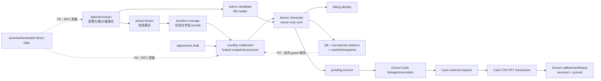
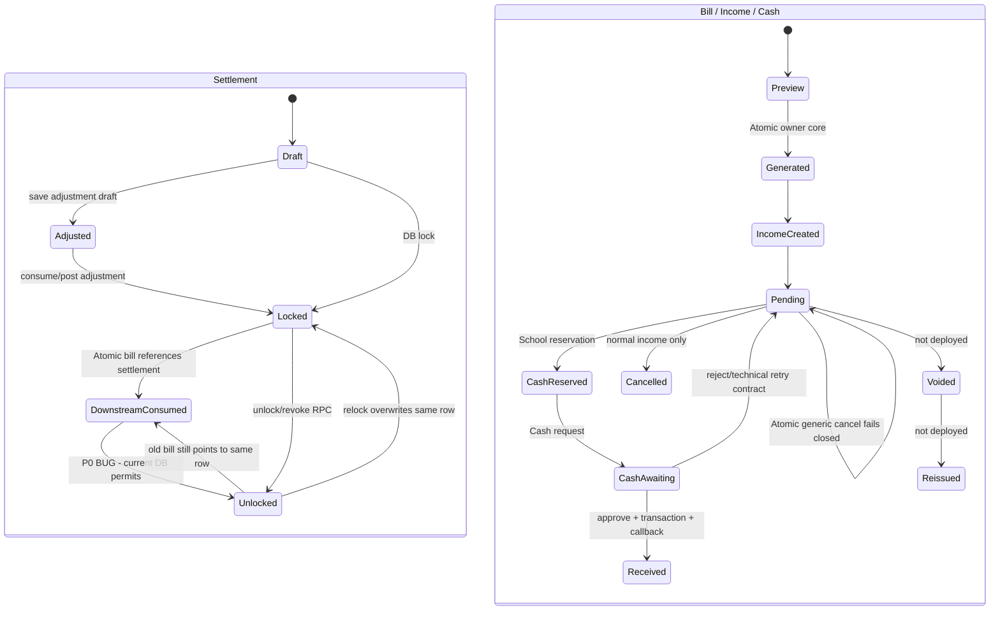

# School V2 学费财务权威与状态矩阵（2026-08-03）

## 1. 结论与标记

本文件记录生产实际状态，而不是理想设计。审计使用 School/Cash 独立的 `REPEATABLE READ READ ONLY` 快照、生产 `pg_get_functiondef`/catalog、仓库 SQL/API/page/Edge Function 和 Git 历史交叉验证；未执行 DDL、DML、write RPC、Gate 写入或业务操作。

- **P0**：当前收费运营必须继续冻结。核心原因不是账单算法普遍错误，而是已消费 settlement 可被解锁/覆盖，以及财务表存在 RPC 之外的直接 DML 旁路。
- **REAL**：张倬闻 2026-08 active bill 仍引用一个当前已 `unlocked` 的 2026-07 settlement；这是已发生的上下游状态矛盾。
- **FROZEN-VALID**：该 bill 的 frozen carryover evidence、manifest、identity、income 和 lesson relations 仍可验证；旧 snapshot 没有因源行变化而失去自身可证明性。
- **NOT PROVEN**：未证明全部生产函数与仓库逐字节一致；未取得部署 Edge bundle 的源字节作逐字节比对；缺失的 R2-F-A 产物标记为 `UNAVAILABLE`。

## 2. 权威对象图

## 3. 业务事实权威矩阵

| 业务事实 | 当前唯一业务权威 | 第二权威/漂移风险 | 正式 writer | 正式 reader | 可变性与结论 |
|---|---|---|---|---|---|
| planned 收费归属 | `school_lesson_records.billing_month`、`billing_week_start_date`、canonical evidence | legacy `year_month/lesson_date` 仅兼容；直接 DML 可绕 writer | lesson API → verified RPC | candidate/resolver RPC | 未被 actual/bill/settlement 消费前可按受控规则改；**P0：表级旁路** |
| actual 完成事实 | actual `school_lesson_records` 与 source planned 关系 | 页面自动算 `lesson_fee` 后作为写参；**持久化第二决定者** | lesson API → actual RPC | lesson/settlement/wage readers | 创建后应冻结；**P0：前端持久化金额 + 表级旁路** |
| duration overage | actual 行冻结的分钟/JPY/CNY/source-month 五字段 bundle | 无已发现第二算法；前端仅展示 | actual RPC 内 DB calculator | settlement preview/lock | 创建后不可变；当前 2 行，张倬闻为 15 分钟/JPY2,500/CNY107.50 |
| settlement 系统差额 | settlement preview/lock 的 DB 计算结果和 locked 行 | unlock/relock 可覆盖同一行；表可直接 DML | lock/relock RPC | settlement/tuition readers | locked 后本应冻结；**P0：downstream-consumed 后仍可覆盖** |
| settlement 调整额 | draft/posted adjustment 表中的明确金额 | UI 的 `clear/carry` 模式宣称 DB 算但 RPC 要求金额 | adjustment API → RPC | settlement lock/preview | manual 是用户明确输入；clear/carry 当前 fail-closed；**UI_BACKEND_CONTRACT_DRIFT** |
| locked carryover | locked settlement 的 frozen carryover/system difference bundle | bill 同时保存不可变 previous-settlement evidence；两者语义应为 live authority vs historical evidence | settlement lock | Atomic preview/generate；bill snapshot validator | bill 生成后 settlement 本应永久不可重开；当前无反向 guard |
| 当前有效 bill | `school_student_tuition_billing_identities` 唯一 student/entity/month 指向 active bill；bill/relation/manifest 共同验证 | incident/legacy 仅历史证据，不是 active authority | Atomic owner core | bill/income/Cash validators/API | Atomic generic cancel 禁止；尚无 deployed void/reissue |
| 当前有效 income | bill 的反向 income FK + `school_income_records` | generic income UI 仍显示 Atomic cancel 入口，但 DB 拒绝 | Atomic owner core / normal income RPC | income/Cash preflight | pending → received；Atomic 不得 generic cancel |
| Cash reservation | School Cash linkage 的 idempotent reservation/request/status | 3 条 legacy normal-income linkage 无 request 是历史路径，非当前 tuition | School service-role Edge/RPC | School preflight/callback | pending/awaiting/synced；tuition 16/16 当前一致 |
| Cash 实际 transaction | Cash CNY/JPY external transaction row | School 只保存 linkage/transaction id，不维护 Cash 余额 | Cash approval owner path | Cash ledger + School callback | external transaction trigger/RLS/ACL 不可 update/delete；应保留 fail-closed |

红线汇总：

1. `school_lesson_records`、settlement、draft、adjustment、carryover 的 anon/authenticated 权限允许直接写，RPC guard 不是唯一写入口。
2. lesson page 以 `Math.round(durationHours * unitPrice)` 自动生成 `lesson_fee` 并提交；生产 actual RPC 对非 NULL `p_lesson_fee` 直接采用。违反当前 P0 DB-authority 边界。
3. active bill 只在 generate 时正向要求 previous settlement 为 locked；bill 建立后，settlement unlock/relock 没有反向 guard，也未使用同一个 tuition operation lock。
4. Atomic bill/Cash 金额没有前端重算：generate 只传用户明确汇率和 manifest，DB 冻结 CNY；tuition Cash preflight 返回冻结金额，API 不提交客户端 amount/rate。这部分权威边界正确。

## 4. 生产对象清单（关键对象）

| 层 | 当前对象与合同 | 权限/保护 | 审计结论 |
|---|---|---|---|
| table | `school_lesson_records` | RLS `ALL true`；anon/authenticated CRUD | **P0 直接 DML 旁路** |
| table | settlement、adjustment draft/adjustment、carryover | settlement/carryover 宽 RLS；draft/adjustment RLS 关闭；anon/authenticated CRUD | **P0 直接 DML 旁路** |
| table | tuition bill、billing identity、bill lessons、income、School Cash linkage | identity/relations unique/FK/validator triggers；incident 隔离 | canonical 15 链全部通过；权限仍须按表逐项保持 RPC-only |
| function | settlement preview/lock/unlock/relock/adjustment RPC | production 为 `SECURITY DEFINER`，多项可由 PUBLIC/anon/authenticated 执行 | 正向校验存在；反向 bill guard/共享 lock 缺失 |
| function | candidate/validation preview/Atomic owner core/public wrapper | owner core 仅 postgres；public wrapper 受 Gate 控制 | generate 原子写 identity/bill/relation/snapshot/income，正向合同完整 |
| function | bill-income、identity、bill-lesson validators | 审计前确认函数体只读后调用 | 15/15 canonical 链全部通过 |
| trigger | bill/income/linkage/lesson integrity and immutability triggers | deferred validator、incident/canonical guards | 可保护已知表内变更；不能替代缺失的 settlement 反向依赖与 ACL |
| trigger | settlement/draft/adjustment/carryover | 本次 catalog 未发现能闭合 active bill 反向依赖的 trigger | **P0 缺失** |
| unique/index | identity student/entity/month；active bill student/entity/month；canonical planned lesson claim | 当前重复 active identity/lesson claim 均 0 | relation role 变为 inactive/legacy 后可释放 lesson claim |
| unique/index | previous settlement/carryover claim | 无 `previous_settlement_id` active-only 唯一约束 | **结构允许重复消费，当前真实重复数 0** |
| Edge | request/sync Cash functions | deployment 为 ACTIVE；service-role 与 Cash external request 合同 | bundle hash 可读；部署源码逐字节相等 `NOT PROVEN` |
| Gate | preview/generate/Cash submit | 生产均为 `enabled` | 与业务负责人本轮运营冻结决定冲突；本轮禁止写 Gate，故只记录 |

生产关键函数 MD5 抽样与仓库 postdeploy/assertion 一致：Atomic wrapper `36bdadc9af59637c9d336ce68d9afb4c`、owner core `b88f6d960d920c10b914fe8e58cf38cb`、Cash preflight `23aa4f04fa20053e4b38af49067c6a2f`、settlement lock `523058b631837025101d558668ce10c8`、unlock `dfeaa0243b27999724cc06bd1f1efbb6`、relock `5b313cc696057a4a1f960ed8f1b50124`。未证明全部函数逐字节无漂移。

## 5. Writer inventory

缩写：`U` 用户明确输入；`F` 前端推导；`D` DB 权威计算；`SR` service role。所有页面模块均未发现直接 `.rpc()` 或直接表写；正式页面写入经 `js/api/*-api.js`。

| 动作与实际调用链 | 输入来源 / 权威计算 | lock、幂等、写表 | 下游 guard / 缺口 / 权限 |
|---|---|---|---|
| 新建/编辑 planned：page → lesson API → lesson RPC → lesson table/trigger | 日期、学生、课程等 U；`lesson_fee` 存在 F 自动值 | RPC/trigger 校验并写 lesson | actual/bill/settlement guards 不完全统一；anon/authenticated 可直接表写；**P0** |
| planned → actual：page → lesson API → `school_create_actual_lesson_from_planned` | 完成数据 U；fee 通常由 F 计算并作为非 NULL 参数；overage D | 锁 source planned；写 actual/source 状态；overage D 一次冻结 | RPC 检查重复、月结/工资锁；但表级旁路和跨 writer 共用 operation lock 缺失；**P0 fee** |
| actual overage：actual RPC 内部 calculator | 分钟差/JPY/CNY 全 D | 与 actual 同事务写五字段 bundle | 已冻结后不可变；当前 reader 不重复计算，合同正确 |
| 保存差额调整：page → settlement API → draft adjustment RPC | mode U；manual amount U；carry/clear 时 amount 为 NULL | 写 draft；无统一 lock key | RPC 对所有 mode 要求 amount，导致 carry/clear DB 拒绝；表可直接写 |
| 抹平差额 | UI 字段 readonly，宣称 D；实际 RPC 不按 mode 计算 | 当前不产生成功写入 | 正确目标应为 DB 读取系统差额并计算精确相反数；当前 fail-closed |
| 手动调整 | amount 为 U（如 -107.50） | 写显式人工调整审计 | 与“抹平”数值可相同但审计语义不同，不可互换 |
| settlement lock：page → API → lock RPC | rate/备注 U；system difference、overage、carryover D | 对 student/month 行锁；写/更新 settlement、消费 draft/生成 adjustment/carryover | 生成时正向 guards 较完整；表旁路；downstream-consumed 状态不是显式状态 |
| unlock/revoke：page → API → unlock RPC | reason U | 锁 settlement 并将同一行改为 unlocked | 检查 legacy evidence、posted adjustment、active carryover、wage；**不检查 active bill/Cash，不用 tuition lock** |
| relock：page → API → relock RPC | rate/备注 U；金额 D 重算 | 覆盖同一 settlement 行金额/snapshot | 同上；可能覆盖 active bill 的 live upstream，**P0** |
| tuition generate：page → tuition API → public wrapper → owner core | student/month/rate/note/opaque manifest U；candidate/amount/carryover/CNY D | advisory/table/row locks；幂等 identity；原子写 identity/bill/relation/snapshot/income | generate 时要求 settlement locked；其他 settlement writer 不取同一 operation lock；direct DML phantom 风险 |
| income generic cancel：income page → API → cancellation RPC | reason U | normal income 可撤销/冲正其支持对象 | Atomic source 返回 `TUITION_ATOMIC_CANCEL_FORBIDDEN`；应保留；UI 入口未隐藏 |
| Cash reservation/preflight：income page → API/Edge → School RPC/linkage | account/date U；tuition currency/amount/rate D frozen | idempotency key + reservation；写 linkage | 已有 Cash fact阻止重复/冲突；tuition 不接受客户端 amount/rate |
| Cash submit：School Edge → Cash external create RPC | request payload来自 School frozen fact；SR 调用 | Cash request idempotency；写 external request | Cash RPC/service boundary 正确；共享普通 income UI 但 tuition 控件只读 |
| Cash approve/reject/callback：Cash page → Cash RPC → sync Edge → School RPC | 操作 U；transaction amount/date/account取 approved request | request/transaction idempotency；写 Cash transaction，再 School income/linkage | external transaction update/delete trigger + RLS/ACL fail-closed；当前 cross-DB anomaly 0 |
| proposed Void/Reissue | 未部署；仅未跟踪 schema/writer/reader/registration fragments | 原提案含 generation identities/revisions/void events、manifest registration、共享 operation lock | 三表无法闭合 settlement reverse dependency；当前草案不得部署，必须修改设计 |

## 6. 当前实际状态机

| 转换 | 入口/调用者 | DB 前置、上下游检查 | 重复/回退/历史影响 | 结论 |
|---|---|---|---|---|
| draft → adjusted | settlement page / anon-authenticated RPC | mode/amount 合同不一致；无 bill dependency | 可改 draft；表级旁路 | drift + P0 ACL |
| draft/adjusted → locked | settlement RPC | DB 重算；检查 month/lesson/wage 等 | 同月同 row；生成 frozen事实 | 正向 authority 基本正确 |
| locked → unlocked/revoked | settlement RPC | 仅检查 settlement/carryover/wage/legacy；不查 active bill | 可回退；同一 row 状态变化 | **P0** |
| unlocked → relocked | settlement RPC | 重算并覆盖；不查 active bill | 旧 bill snapshot仍可验证，但 live upstream 可矛盾 | **P0** |
| locked → downstream-consumed | Atomic core | generate 时查 locked/金额/hash | bill snapshot不可变 | 正向成立，反向缺失 |
| preview → generated/income_created/pending | tuition page → API → DB | candidate、manifest、identity、relations 全 DB 验证 | student/month 幂等；冲突 fail-closed | 当前链完整 |
| pending → Cash reserved/awaiting | School Edge/SR | frozen tuition amount、linkage/idempotency、无既有 Cash事实 | 重试幂等 | 当前链完整 |
| awaiting → received | Cash approve + callback | request状态/transaction idempotency | transaction不可变；不能回退普通编辑 | 应保留 |
| pending Atomic → generic cancelled | UI 可触发，DB拒绝 | `TUITION_ATOMIC_CANCEL_FORBIDDEN` | 不写 | **INTENTIONAL_FAIL_CLOSED** |
| Atomic → voided → reissued | 无生产入口 | 未部署 | 未知 | 必须先补 settlement dependency 后再实现 |

## 7. 依赖与反向 guard 矩阵

| 上游事实 | 下游消费者 | 下游存在后应否可变 | 当前 DB guard | 结论 |
|---|---|---:|---:|---|
| planned | actual | 核心收费/归属否 | RPC 部分有；表级旁路存在 | **P0** |
| planned | active bill relation | 被 claim 字段否 | relation/lesson triggers + unique claim；表级旁路仍需收口 | P0 boundary |
| actual overage | settlement snapshot | 否 | overage bundle冻结；settlement重开仍可能重新聚合 | settlement consumed 前可受控重开；之后 P0 |
| settlement adjustment | locked settlement | posted 后否 | lock 消费/posted检查；直接 DML 旁路 | **P0** |
| locked settlement | active Atomic bill | 否 | generate 仅正向检查；unlock/relock 无反向检查 | **P0，真实发生** |
| carryover snapshot | active Atomic bill | 否 | bill 保存 frozen evidence/hash；无 active-only settlement claim unique | **P0 guard 缺失；当前重复消费 0** |
| bill | pending income | 原子生成后不可单边变 | deferred validators/FK | 当前通过 |
| income | School Cash reservation | reservation 后金额/币种/来源不可变 | preflight/linkage guards | 当前通过 |
| School reservation | Cash request | 仅幂等重试 | idempotency/request status | 当前通过 |
| Cash request | Cash transaction | approved 后 request/transaction不可重开 | Cash trigger/RLS/ACL/idempotency | 当前通过 |

反向不变量逐项结果：

| 不变量 | 生产结果 | 优先级 |
|---|---|---|
| active bill 后 settlement 禁止 unlock | 不存在；张倬闻已违反 | **P0** |
| active bill 后 settlement 禁止 revoke | 不存在等价保护 | **P0** |
| active bill 后 settlement 禁止调整 | 没有统一 active-bill dependency guard；部分路径因其他条件拒绝 | **P0** |
| active bill 后 settlement 禁止覆盖 snapshot | relock 可覆盖同一 row | **P0** |
| Cash reservation 后 bill/income 禁止 void | School preflight/linkage检查存在；Atomic generic cancel整体阻断 | 通过，Void 必须复用 |
| Cash transaction 后历史财务事实禁止重开 | Cash external transaction不可变；School received/synced锁定 | 通过，应保留 |
| voided bill 不占 active lesson claim | 当前 legacy cancelled relation role不占 canonical claim；proposed revision需维持 active-only | 当前通过/新设计待证 |
| voided bill 不占 active carryover claim | 无 deployed void，也无 active carryover claim unique | **P0 设计缺口** |
| 旧 snapshot 不因源表变化失去可验证性 | Atomic 8/8 frozen carryover evidence hash有效；但 live pointer可矛盾 | snapshot 自证通过，状态机失败 |

## 8. 锁、幂等与 claim

| 范围 | 当前 key/claim | 结果 |
|---|---|---|
| Atomic generate | student/entity/month identity、advisory/table/row locks、opaque manifest | 防自身重复；15 canonical identity 唯一 |
| lesson claim | canonical relation 对 planned lesson 的唯一 claim | active 重复 0；1 legacy cancelled bill 的 12 relation 已转 inactive role |
| previous settlement/carryover | bill `previous_settlement_id` + frozen evidence | 无 active-only唯一 claim；当前复用 0，结构允许 |
| School Cash | linkage/request/transaction idempotency key | current tuition 16 条全部一致；重复 key 0 |
| Cash transaction | external request idempotency + transaction idempotency | approved-without-transaction 0；nonapproved-with-transaction 0 |
| cross-writer operation | generate 草案有 operation lock；settlement/lesson/Cash/void 未统一 | **P0：并发与反向 writer 未闭合** |

## 9. 最小状态合同

恢复运营前应采用以下唯一、可验证合同：

1. **已被 active bill 消费的 settlement 永久不可 unlock/revoke/relock/覆盖。** 错误采用 forward adjustment；不在本轮引入 settlement revision。
2. settlement、adjustment、carryover 及影响收费事实的 lesson 写入必须 DB/RPC-only；撤销 anon/authenticated 直接表 DML。
3. `lesson_fee` 的保存值必须由 DB 根据 authoritative inputs 计算或验证；前端自动值只能展示，不能作为决定性写参。
4. clear/carry adjustment 的金额由 DB 按 mode 计算；manual 才接收用户明确金额。
5. generate、settlement mutation、未来 Void/Reissue 对同一 student/month/dependency 使用同一锁协议并双向检查。
6. Cash 现有 frozen amount、reservation/idempotency、external transaction immutability 合同保持不变。
