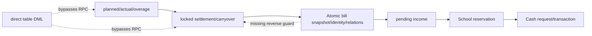

# School V2 学费财务全链只读稳定性审计（2026-08-03）

## 1. 执行摘要

**结论：School V2 学费财务写入链当前不可安全运营。** 继续冻结 settlement lock/unlock/revoke/relock、差额调整、tuition generate、Atomic Void/Reissue、学费 Cash submit 和所有真实 carryover/bill/income/Cash 操作。

审计同时确认两个不同层次的事实：

1. 已有 canonical 数据并非全面损坏：15/15 canonical tuition chain 的 identity、bill-income、bill-lessons validator 全部通过；Atomic frozen carryover evidence 8/8 hash 有效；当前 16 条 tuition School↔Cash 链一致，Cash request/transaction 幂等与不可变异常均为 0。
2. 业务不变量已被真实突破：张倬闻 2026-08 active bill 引用的 2026-07 settlement 在账单生成后被解锁。账单冻结证据仍自洽，但 live upstream 已与 active downstream 矛盾。生产 unlock/relock 不检查 active bill，也不使用 Atomic generate 的同一锁协议。

此外存在三项恢复运营前必须关闭的系统级 P0：

- settlement/adjustment/carryover 与 lesson 财务事实可由 anon/authenticated 直接表 DML，RPC guard 存在旁路；
- lesson page 自动计算并提交持久化 `lesson_fee`，生产 RPC 对非 NULL 值直接采用，违反 DB 权威边界；
- adjustment `clear/carry` UI 与 RPC 合同不一致，且 consumed settlement 没有永久冻结规则。

本次建议唯一采用 **方案 A：先集中封口 V2 学费财务链，再恢复运营**。不建议因当前证据整体重建 V2；也不建议直接部署现有 Void/Reissue 草案。三表 revision 模型应保留方向但必须修改，先闭合 settlement dependency、RPC-only 权限和共享锁。

## 2. 审计边界、基线与执行事实

### 2.1 Git 基线

| 项目 | 结果 |
|---|---|
| 分支 | `main` |
| 审计起始 HEAD | `b6076ab08e0f52e513d6b6aaf48767da790b9fff` |
| parent | `8fa5ed418a627a50d3bc39c8b58cfbd0fbd6702b` |
| 起始 `origin/main` | 与 HEAD 相同 |
| staged / tracked unstaged | 0 / 0 |
| 起始 untracked | 6，均未修改、删除或暂存 |

受保护未跟踪证据：

| 路径 | SHA-256 |
|---|---|
| `docs/school-v2-2026-05-06-tuition-candidate-manual-review-completed-20260801.csv` | `272d08531c39b69d1f7392f367229536174e20f54c86883f6cf469c0d2578432` |
| `docs/school-v2-r1b-eight-api-complete-git-diff-20260727.txt` | `5b11f064b4caa01c3015b3b55b6db8bf5c38fd3607182d1b124a120662db2093` |

暂停中的 Void/Reissue 未跟踪草案同样受保护：

| 路径 | SHA-256 |
|---|---|
| `sql/current/school_tuition_atomic_void_reissue_reader_fragment_20260803.sql` | `b8e02481d282fa681d7cef332f70c92b302415563810f4d160c087a65202ab54` |
| `sql/current/school_tuition_atomic_void_reissue_registration_fragment_20260803.sql` | `5dc7c39c2c663a03eff34223a8a86ebcbd091fbf976b2295cbace9940e7fda1a` |
| `sql/current/school_tuition_atomic_void_reissue_schema_fragment_20260803.sql` | `b9c13ddc107a799a914aabbc2eac4663314cacc4f31005ffb4c365902b040773` |
| `sql/current/school_tuition_atomic_void_reissue_writer_fragment_20260803.sql` | `7ed27844edde2b18b241ec9c23de8c5faed07bd8d5bcee2d97b3252f1855939b` |

### 2.2 数据库与部署基线

- School 逻辑目标：V2 School Supabase project ref `xlcdqvlfzspcxdoidsrr`，仅使用 `SCHOOL_SUPABASE_DB_URL`；Cash 逻辑目标：独立 Cash DB，仅使用 `CASH_SUPABASE_DB_URL`。URL/secret 未打印、保存或提交。
- `psql` 与两数据库连接可用；查询尽量在 `BEGIN ISOLATION LEVEL REPEATABLE READ READ ONLY` 内执行。
- 生产 Gate：`student_tuition_preview=enabled`、`student_tuition_generate=enabled`、`student_tuition_cash_submit=enabled`。这只是生产值；业务负责人本轮运营冻结决定优先。本轮未写 Gate。
- 未执行任何 SQL 文件、DDL、DML、write RPC、Edge 部署、Cash request/approve/reject 或真实业务操作。
- 仅在先读取并确认函数体无写语句后，调用三个只读 chain validator。
- 审计中两次初始只读查询因 shell quoting 报错，事务仅执行了 `BEGIN` 后失败；没有写入。

## 3. 当前是否可安全运营

不能。停止条件由以下 P0 证据同时成立触发：

1. **真实反向依赖失败**：active Atomic bill → previous settlement 的反向 immutability 不存在；张倬闻已成为真实实例。
2. **RPC 不是唯一 writer**：关键财务表向 anon/authenticated 开放 CRUD；只修 RPC 不能保证事实唯一。
3. **持久化金额由前端参与决定**：planned/actual lesson fee 写入链违反当前项目最高优先级边界。
4. **并发/状态协议不统一**：Atomic generate 的 operation/table lock 不被 settlement/lesson/未来 void writer 共同使用；R2-F-B 报告已记录这一缺口，但后来仍启用了 generate/Cash Gate。

read-only preview 可以作为调查工具继续使用，但不能把 Gate 的 `enabled` 解释为业务安全认证。

## 4. 全链权威对象与 writer/state/dependency

权威对象图、逐事实 authority、完整 writer inventory、实际状态机、转换表、依赖矩阵、reverse guard、权限、claim、lock 和幂等清单见：

`docs/school-v2-tuition-finance-authority-and-state-matrix-20260803.md`

核心关系如下：

## 5. 最近变更与问题分类

准确审计窗口为 2026-07-26 00:00 JST 至起始 HEAD `b6076ab`。对 tuition/settlement/carryover/overage/identity/bill/income/Cash/cancel/lock/preview/date attribution 的相关 commit 逐项核对，矩阵见附录 A。

### 5.1 当前问题分类

| 问题 | 分类 | 依据 |
|---|---|---|
| settlement unlock/relock 不检查 active bill | `PRE_EXISTING_LATENT_DEFECT` + 集成层 `RECENT_REGRESSION` | unlock/relock 旧实现长期缺 guard；`10aaeff`/`29705d6` 启用并恢复消费 settlement 的 Atomic writer，却未先补反向 guard，最终产生真实矛盾 |
| settlement/lesson 等表 broad ACL/RLS | `PRE_EXISTING_LATENT_DEFECT` | V2 无登录历史技术债；对财务链而言已构成可绕 RPC 的 P0，不再可作为运营例外 |
| 页面自动计算并提交 `lesson_fee` | `PRE_EXISTING_LATENT_DEFECT` | 早于本窗口存在；当前 P0 规则下前端决定持久化金额，DB 只在 NULL 时计算 |
| clear/carry adjustment 仍要求 amount | `UI_BACKEND_CONTRACT_DRIFT` + `PRE_EXISTING_LATENT_DEFECT` | UI 发送 NULL 且宣称 DB 算；RPC 对所有 mode 要求 numeric，故 readonly UI 只能失败 |
| Atomic 页面仍展示 generic cancel | `UI_BACKEND_CONTRACT_DRIFT` | 后端正确返回 `TUITION_ATOMIC_CANCEL_FORBIDDEN`，页面合同未收口 |
| Atomic generic cancel 禁止 | `INTENTIONAL_FAIL_CLOSED` | generic cancel 不能原子处理 identity、relations、carryover/revision/Cash locks，必须保留 |
| owner-only Atomic core / disabled legacy overload | `INTENTIONAL_FAIL_CLOSED` | 防止绕过 manifest/identity/relations/snapshot 原子合同 |
| Cash frozen amount、external transaction immutable | `INTENTIONAL_FAIL_CLOSED` | tuition submit 不采客户端 amount/rate；external transaction 禁 update/delete，当前 anomalies 0 |
| 张倬闻实际付款 27,950 应如何入账 | `UNDECIDED_BUSINESS_RULE` | 外部事实；无法从当前 DB 推导是汇率 0.042、原报价 0.043、carryover 清零或需 void/reissue |
| Edge 部署 bundle 与 repo 源逐字节相同 | `NOT_PROVEN` | 可见 ACTIVE/version/bundle hash，但未取得部署源码 bytes |
| settlement 完整状态历史/谁执行 unlock | `NOT_PROVEN` | 只有当前行与时间/reason，没有 revision/event ledger 可还原全部历史动作 |
| R2-F-A 产物 | `UNAVAILABLE` | 后续报告引用但仓库未找到可审计权威产物 |

### 5.2 局部修复模式

最近修复普遍强化了某个 forward writer：candidate、identity、manifest、table lock、Cash preflight、Cash immutability 都有高质量定向验证。但固定 E2E 矩阵没有在 Gate 开启前强制验证“下游存在后上游所有 writer 都必须拒绝”，也没有把 direct DML、settlement writer、generate、Cash 和未来 Void 放入同一状态机与共享锁协议。

这是**流程层的局部闭环**，不是所有近期 commit 都错误。特别是 R2-F-B 报告已经明确记录其他 writer 未使用同一 operation lock、direct DML 仍可能形成 phantom；后续启用 Gate 时该已知风险没有升级为阻断项。

## 6. 专项审计

### 6.1 Atomic generic cancellation 与 Void/Reissue

- `TUITION_ATOMIC_CANCEL_FORBIDDEN` 正确，应永久保留到 dedicated flow 完成。
- generic cancellation 只覆盖其正常 bill/income 撤销范围，不能可靠地同时变更 billing identity、normalized relation claims、previous settlement/carryover claim、generation revision/manifest 和 Cash reservation/transaction locks。
- Void/Reissue 是必要模型方向，但当前 production 完全未部署。四个未跟踪 fragment 只作为草案证据。
- 已批准的三表 revision/identity/void-event、`manifest_kind`、`historical_registration_manifest_v1` 和方案 B fixture lifecycle 批准继续有效，但**三表方案目前不足**：它没有在 DB dependency boundary 冻结 consumed settlement，也未让 settlement writer 使用共享锁。
- 决策：**修改后继续，不废弃；在 P0 settlement boundary 关闭前不得实现或部署。**

### 6.2 Settlement 差额调整

| 模式 | 应有语义 | 当前实现 | 结论 |
|---|---|---|---|
| 按最终差额结转 | DB 保存按当前权威规则计算/确认的 carry 结果 | UI 发送 NULL amount；RPC 仍要求 numeric | contract drift，当前 fail-closed |
| 抹平差额 | DB 读取 authoritative system difference，保存其精确相反数并标记 clear 语义 | UI readonly 且发送 NULL；RPC 不按 mode 计算 | “请选择后仍要求金额”的直接原因 |
| 手动调整 | 用户明确输入 amount，保留人工覆盖理由/审计 | RPC 可保存 numeric | 可与 clear 数值相同，但审计语义不同 |

页面展示 `system_difference + adjustment` 的非持久化 preview 本身允许；问题在于 DB 没有实现 non-manual mode 的权威金额合同。`manual -107.50` 表示人工决定；`clear` 表示系统按当时权威差额自动归零，二者不可互换。

### 6.3 Settlement 撤销与下游账单

生产 unlock/relock 会检查 locked 状态、legacy snapshot evidence、posted adjustment、active carryover 和 teacher wage blocker；**不会检查 active tuition bill 或 Cash**。relock 会重算并覆盖同一 settlement 行的 system difference/carryover/overage。generate 只在正向读取时检查 locked。

旧 bill evidence 仍可通过 frozen JSON/hash 验证，但 live FK 指向一个现在 unlocked 的 row，形成“双层事实不一致”。最小恢复策略是不引入 settlement revision，而是：一旦被 active bill 消费，永久禁止 unlock/revoke/adjust/relock/overwrite；错误使用 forward adjustment。只有业务明确要求修改已消费历史时，再单独批准 settlement revision 模型。

### 6.4 Cash 冻结金额

Atomic generate 冻结用户明确 exchange rate、DB 计算的基础金额、previous carryover 和 final CNY amount；Cash preflight 从 bill/income frozen fact 返回金额。tuition Cash API 不提交客户端 amount/rate/rounding，DB 也不接受共享 UI 控件改写 tuition 数值。

旧汇率/今日汇率/ceil/floor 曾属于共享普通 income 交互，当前 tuition 分支已 readonly/忽略。普通 income 可使用用户明确输入；Atomic Tuition 必须继续走 frozen contract。当前不是持久化计算缺陷，但共享 UI 仍应在 P2 去除误导。

### 6.5 Carryover 与 overage

张倬闻 `15 分钟 / JPY2,500 / CNY107.50` 由 actual RPC 的 DB-authoritative overage bundle 产生，进入 2026-07 locked settlement，再作为 2026-08 bill 的 `previous_settlement_id`、amount 和 frozen evidence/hash 被一次读取。preview/generate/Cash 没有重复换算或重复消费；Cash 只用 final frozen bill amount。

缺口是结构上没有 active-only previous-settlement/carryover unique claim，也没有消费后的 settlement immutability。当前同一 settlement 被多个 active bill 复用数为 0，但 schema 允许；张倬闻 settlement 状态变化后 bill 仍引用旧值，已形成真实状态矛盾。

## 7. 全量真实数据只读一致性结果

### 7.1 规模

| School 对象 | 数量 | Cash 对象 | 数量 |
|---|---:|---|---:|
| active students | 8 | external requests | 39 |
| lessons | 729（planned 480；actual-like 249） | CNY transactions | 68 |
| overage rows | 2 | JPY transactions | 31 |
| settlements | 17 | tuition approved requests | 16 |
| adjustment drafts / adjustments / carryovers | 6 / 5 / 8 | tuition linked transactions | 16 |
| billing identities / bills / bill lessons | 15 / 17 / 256 |  |  |
| incomes / School Cash linkages | 50 / 40 |  |  |

17 张 bill 中：15 张 canonical identity bill，1 张张倬闻 incident duplicate/quarantined chain，1 张陈加恩 legacy cancelled chain。canonical validator 结果：identity 15/15、bill-income 15/15、bill-lessons 15/15。

### 7.2 一致性矩阵

| 检查 | 结果 | 分类 |
|---|---:|---|
| identity↔bill mismatch | 0 | 通过 |
| bill↔income mismatch | 0 | 通过 |
| normalized relation/header mismatch | 0 | 通过 |
| same student/month multiple active identity | 0 | 通过 |
| active lesson duplicate claim | 0 | 通过 |
| reused previous settlement among active bills | 0 | 结构允许、尚未发生 |
| Atomic carryover evidence hash | 8/8 valid | 通过 |
| Atomic manifest across bill/identity/income | 8/8 consistent | 通过 |
| active bill references unlocked settlement | **1** | **已发生真实不一致** |
| upstream settlement updated after bill | **1** | **已发生真实不一致** |
| pending income already has Cash fact | 0 | 通过 |
| received income unsynced School linkage | 0 | 通过 |
| Cash approved request without transaction | 0 | 通过 |
| Cash non-approved request with transaction | 0 | 通过 |
| duplicate Cash request/transaction idempotency | 0 / 0 | 通过 |

School linkages 40 条中，16 条当前 tuition 全部 synced/approved；其余为 15 historical-confirmed normal income、6 synced normal income、3 legacy direct-sync normal income。3 条无 request 的 legacy link 不是当前 tuition anomaly。

## 8. 重点真实对象

### 8.1 张倬闻

| 事实 | 只读生产结果 |
|---|---|
| student | `7aef8061-7037-4881-a847-a2cdb031c0f4` |
| 2026-07 settlement | `b699209d-2f61-4cfa-959b-45686e2fe19b`，当前 `unlocked` |
| locked / unlocked | 2026-07-31 18:16:05Z / 2026-08-02 07:22:46Z；reason `修复课时` |
| system difference / adjustment / carryover | CNY107.50 / 0 / CNY107.50 |
| overage | 15 分钟 / JPY2,500 / CNY107.50 |
| 2026-08 bill | `553a24ba-81cf-4af0-b723-169a09914c79`，2026-08-01 18:35:59Z |
| bill frozen facts | JPY650,000；rate 0.042；base CNY27,300；previous carryover CNY107.50；final CNY27,407.50 |
| income | `be64a9e2-f15e-44b0-a9de-2ee91bdf9567`，`pending` |
| School/Cash | 无 linkage、request 或 transaction |
| frozen evidence | settlement 当时为 locked，amount CNY107.50；hash valid |

权威判断：当前 active bill 的应收金额仍是其不可变 frozen contract **CNY27,407.50**；当前 settlement live 状态与该 bill 的 dependency contract 矛盾。不能把 user-provided 实付 27,950 未经证据写回，也不能直接编辑 bill/settlement。

| 情景 | 计算 | 应收 | 实付 27,950 与应收差额（实付－应收） |
|---|---|---:|---:|
| 当前系统账单 | frozen bill | CNY27,407.50 | **+CNY542.50** |
| 原报价 0.043 + 当前 carryover | 650,000×0.043+107.50 | CNY28,057.50 | **-CNY107.50** |
| 原报价 0.043 + 抹平 carryover | 650,000×0.043+0 | CNY27,950.00 | **CNY0.00** |

哪一个情景是业务真相属于 `UNDECIDED_BUSINESS_RULE`。修复前先由业务负责人选择汇率/carryover/付款权威；若 bill 错，应走加固后的 dedicated Void/Reissue；若 bill 对，应通过受控审计流程恢复/解释 settlement dependency，不能直接 relock。

### 8.2 彭宇晗

- 2026-08 bill `1e02dc09-...`、identity `2dd30b...`、pending income `ae4d8b66...`；15 relations。
- frozen facts：JPY255,000、rate 0.0415、CNY10,582.50；无 previous settlement/carryover，无 Cash事实。
- identity/bill-income/bill-lessons/manifest 均通过；generic cancel 正确被 Atomic guard 阻断。
- 当前没有对象级不一致，理论上满足 dedicated Void 的“pending/no Cash”前置；但系统级 P0 未关，**不得操作**。

### 8.3 李天伦

- 2026-08 bill `5e032651-...`、identity `45b7...`、pending income `1de45...`；16 relations（lesson_count 21）。
- frozen facts：JPY352,000、rate 0.0427、CNY15,030.40；无 previous settlement/carryover，无 Cash事实。
- identity/bill-income/bill-lessons/manifest 均通过；generic cancel 正确被 Atomic guard 阻断。
- 当前没有对象级不一致，理论 Void 前置同彭宇晗；系统级仍不安全，**不得操作**。

历史 preview 报告中的彭宇晗 0.0435/CNY11,092.50、李天伦 0.05/CNY17,600 不是当前生产 frozen bill authority；生产已生成账单分别以 0.0415 和 0.0427 为准。这是文档时点差异，不得拿旧 preview 覆盖账单。

## 9. Repo、生产与文档漂移

| 比较项 | 结果 |
|---|---|
| 关键生产函数 vs repo SQL/assertion | 抽样 MD5 一致；未发现已抽样 critical function drift |
| production-only critical function | 抽样范围未发现；全量逐字节 `NOT PROVEN` |
| repo-only Void/Reissue | 4 个 untracked fragment 存在，生产无对应三表/reader/writer/registration；这是暂停草案，不是部署漂移 |
| triggers/index/constraints/RLS/grants | production catalog 已审；关键缺口是 settlement 反向 trigger 与 broad ACL/RLS，不是 repo 已声明安装而 production 缺失 |
| Edge | request/sync functions 为 ACTIVE（request-cash-confirmation v8、sync v8、tuition income request v10 等）；bundle hash 可见，源码字节相等 `NOT PROVEN` |
| page/API | page 无直接 `.rpc()`/table write；API boundary成立；lesson fee 和 adjustment/cancel UI contract 有上述缺陷 |
| current-status vs production | 状态文档仍写“7 eligible 未提交”；生产已有更多 received/synced tuition，仅张/彭/李三条 pending。属文档时点漂移 |
| Gate描述 | 历史报告包含多组阶段 Gate；生产终态三项 enabled，但业务负责人本轮宣布运营冻结。不得混用 |
| missing report | R2-F-A `UNAVAILABLE`；不能把缺失内容视为已验证 |

## 10. 流程为什么失效，以及协作规则

| 失效因素 | 结论 | 后续强制规则 |
|---|---|---|
| 按模块拆分过细 | 是；forward writer 局部质量高，但 reverse dependency 未作为 Gate 条件 | 每个财务变更维护一张固定 upstream/downstream 矩阵，新增下游即自动枚举所有上游 writer |
| 只验证正向 writer | 是；generate 锁住自身，settlement writer 未共锁 | Gate 前必须跑双向状态转换、并发冲突和 direct-DML negative matrix |
| 缺少统一状态机 | 是；`downstream-consumed` 未成为 settlement DB 状态/guard | 状态机、transition owner、可逆性、历史证据必须进入设计与 postdeploy |
| 页面/RPC/DB 三套规则 | adjustment 与 lesson fee 明确存在 | page 只传 U；DB 计算 D；API schema 标注每个参数来源并静态检查 |
| 报告多但固定 E2E 少 | 是 | 保留一份可执行/可更新的 E2E invariant manifest，而非仅累计阶段报告 |
| 历史兼容旁路 | broad DML/legacy UI 是 | 兼容 reader 可保留；legacy writer 必须 fail-closed 且有退役条件 |
| Gate 只保护执行流程 | 部分成立 | Gate 开启必须同时证明数据、ACL、reverse guards、lock protocol，不只证明目标 RPC |
| 长对话/多轮上下文 | 可能贡献，但无法单独证明 | 每任务从 current-status + invariant matrix 恢复，不依赖会话记忆；`NOT PROVEN` 不得默认为通过 |
| R2-F-A 缺失 | 降低后续可追溯性 | 必读产物缺失不停止只读审计，但 Gate 不得引用其未证明结论 |
| prompt 过早指定 schema | Void 三表在 settlement dependency 未知前不完整 | 先做 authority/dependency declaration，再申请每个业务模型扩展批准 |

## 11. 恢复运营的最小安全集合（仅方案）

### P0：恢复收费前必须完成

| 顺序 | 目标不变量 / 对象 | schema/历史/真实修复 | 风险与验收 |
|---:|---|---|---|
| 1 | 运营 Gate 与业务冻结一致：generate、Cash submit 保持 blocked；preview 可只读 | Gate 写入；无历史 migration；无业务数据修复 | 受控 Gate rollback+commit，production readback；本轮未执行 |
| 2 | consumed settlement 永久不可 unlock/revoke/adjust/relock/overwrite；settlement mutation 与 generate 共用 lock | 需 function/trigger/可能 index；无历史迁移 | rollback/whitelist + 并发矩阵：generate↔unlock/relock 双向只能一方成功；张对象只读回归 |
| 3 | settlement/draft/adjustment/carryover 及 lesson 财务事实 RPC-only | ACL/RLS/trigger hardening；不改历史数据 | anon/authenticated 直接 CRUD 全拒绝，正式 API 正常；service-role最小权限 |
| 4 | persisted lesson fee 唯一由 DB 计算/验证 | RPC/API/page 合同变更；无历史 migration | page payload不含 derived fee；DB negative/rounding matrix；全前端静态检查 |
| 5 | adjustment mode DB-authoritative：carry/clear 不收客户端 amount，manual 只收明确用户值 | RPC/API/page；无历史 migration | 三 mode rollback/whitelist；clear 精确归零且审计语义 distinct |
| 6 | 修改 Void/Reissue：纳入 settlement dependency、active carryover claim、共享锁、Cash terminal blockers | 已批准三表方向需补合同；是否新增 settlement revision 暂为 none | 隔离测试 DB 或获批 committed synthetic fixture 跑并发；不得用真实数据首测 |
| 7 | 张倬闻业务决定与专用 repair plan | 可能需要 dedicated Void/Reissue 或受控 restoration；**必须单独明确批准** | 三种金额合同由业务选择；全链 rollback、whitelist、old snapshot可验证；禁止 direct edit |
| 8 | 全量 E2E re-audit 后再按顺序开 generate、Cash Gate | 无新增模型 | 15+ chains、reverse guard、ACL、Cash cross-DB、并发全部通过；Gate逐项开放 |

依赖：1 → 2/3/4/5 → 6 → 7 → 8。2 与 3 是所有后续写操作的首要数据库边界。

### P1：恢复后尽快完成

| 项目 | 目标/对象 | 变更与验收 |
|---|---|---|
| forward-only settlement correction | 已消费月份只通过下一期显式 adjustment 更正 | 可能需 approved audit object；不改历史；验证新旧 authority 不双写 |
| active previous-settlement claim | 防多个 active bill 复用同一 carryover | 若需 active-only unique/index，先通过 expansion declaration；全库当前重复 0 |
| Edge deployment provenance | repo source 与 deployed bundle 可复现 | CI 记录 source digest/version；部署后 read-only hash 验证 |
| 固定 E2E invariant manifest | 把状态/ACL/locks/validators/Gates 固化为一个 acceptance suite | 每次财务 Gate 变化必须全部重跑 |
| 文档状态自动化 | current-status 不再把时点 preview 当 live operational state | read-only status generator/校验，不写业务 DB |

### P2：冻结或删除

| 项目 | 处理 |
|---|---|
| Atomic generic cancellation UI入口 | 后端 fail-closed 保留；页面隐藏或明确跳转 dedicated flow |
| 旧 generate overload / Personal Cash / legacy direct Cash writers | 保持不可执行，设退役清单；历史 reader 只读保留 |
| tuition 共享 UI 的旧汇率、ceil/floor、amount 控件 | tuition 分支删除误导交互；普通 income 显式区分 |
| 无退出条件的 legacy fallback/dual authority | 禁止新增；现有逐项冻结并记录 retirement condition |

## 12. V2 去留决策

| 方案 | 适用证据 | 成本/边界 | 当前判断 |
|---|---|---|---|
| A：集中封口后继续运营 | canonical 链与 Cash 基本一致；缺口可定位到 reverse guard、ACL、fee/mode合同；真实矛盾仅 1 链 | 定向 DB/API/page 修复 + 一条真实 repair；不重写全系统 | **唯一推荐** |
| B：保留非财务，重建学费核心 | P0 无法在不广泛改写的情况下关闭，或新增多链 authority 冲突 | 保留 student/lesson/master-data read；冻结 settlement/bill/income/Cash link，建立新边界并只读引用历史 | 当前证据不足以触发；作为 P0 实施失败后的退路 |
| C：整体冻结重建 | 非财务模块也出现不可恢复的多权威、广泛历史污染、权限无法隔离或事实无法重建 | 最大范围迁移与运营中断 | 当前无此证据，不推荐 |

**唯一推荐实施顺序：先执行一个严格限界的“P0-A consumed settlement dependency + 财务表 RPC-only boundary”任务；不碰 Void/Reissue 和张倬闻数据。** 验收后再做 lesson fee/adjustment contract，随后修改 Void/Reissue、决定张倬闻 repair，最后全量验收与逐 Gate 恢复。

## 13. 审计局限与 NOT PROVEN

1. 生产 Edge bundle 可列出 ACTIVE/version/hash，但没有把已部署 bundle 源码下载后与 repo 逐字节比较。
2. 对关键函数做了 production definition/MD5 抽样，不代表所有函数、view、trigger 的完整字节等价证明。
3. settlement 没有完整 revision/event history，无法仅凭当前 row 证明每次历史 mutation 的调用者和所有中间值。
4. R2-F-A 权威报告在仓库不可用。
5. 本轮按要求没有跑 write/concurrency fixture，结构性并发结论来自锁/函数定义和既有报告；实际竞争结果必须在未来隔离环境或获批 fixture 中验证。
6. user-provided CNY27,950 是外部业务事实，未与银行/Cash凭证交叉验证。

## 14. 业务负责人要求的 14 个明确回答

1. **当前不可用。** 只读调查可继续，学费财务写操作必须冻结。
2. **已发生真实数据不一致。** 张倬闻 active bill 引用当前 unlocked settlement；账单自身 frozen evidence 仍有效。
3. **存在局部修复模式。** 最近 forward writer/validator 很强，但缺少固定 reverse dependency、ACL 与共享锁 Gate。
4. **近期回归**是启用/恢复 Atomic generate 后把 settlement 变成真实下游依赖，却未先补旧 unlock/relock 反向 guard；随后真实产生矛盾。不是说 unlock 代码本身是近期新增。
5. **旧潜伏缺陷**包括 broad ACL/RLS、settlement 同行覆盖式 unlock/relock、adjustment mode drift、前端持久化 lesson fee。
6. **应保留的 fail-closed**包括 Atomic generic cancel 禁止、legacy generate/owner-core边界、Cash frozen amount/idempotency/external transaction immutability。
7. **张倬闻权威事实**是当前 active frozen bill CNY27,407.50、pending income、无 Cash事实；previous settlement live 状态已矛盾；实付 27,950 只是待业务确认的外部事实。
8. **彭宇晗、李天伦对象链本身一致，但系统仍不安全。** 二者 pending/no Cash，理论满足未来 dedicated Void 前置，当前不得操作。
9. **运营前 P0**：consumed-settlement reverse guard + shared lock、财务表 RPC-only、DB-authoritative lesson fee、DB-authoritative adjustment modes、修改后的 Void/Reissue 并发验收、张对象获批 repair、全量 re-audit/Gate 分步恢复。
10. **Void/Reissue 应修改后继续**，不废弃，也不部署当前 fragment；必须纳入 settlement dependency/claim/共享锁。
11. **当前不需要 settlement revision 才能恢复。** 最小规则是已消费 settlement 永久不可重开，错误 forward adjustment；只有业务必须改历史时再单独批准 revision。
12. **V2 选择集中封口继续运营（方案 A）**；目前没有证据支持财务核心或整套 V2 重建。
13. **下一任务唯一范围**：P0-A consumed settlement 永久冻结、所有相关 settlement writer 共享 tuition lock、settlement/draft/adjustment/carryover 财务表 RPC-only；不做 Void、不修张数据。
14. Git 交付结果在本报告提交/推送后由最终回复给出 commit、parent、push 与最终 worktree；本文件不预写未来 hash。

## 附录 A：2026-07-26 至 2026-08-03 相关 commit 矩阵

“部署”依据仓库报告和本次生产抽样；`文档/设计`不等于生产部署。

| Commit | 目标问题 | 修改对象 / 新权威或状态 | 新增 guard | 遗漏的反向 guard | 部署 | 风险判断 |
|---|---|---|---|---|---|---|
| `4464e9e` | R0 停止不安全收费 | Gate/legacy入口 | 多入口 fail-close | 尚无完整新链 | 是 | intentional fail-closed |
| `6c761f6` | R1A identity foundation | identity/relation schema | unique/FK/ACL | settlement dependency未进入模型 | 是 | 正向基础正确 |
| `c663f32` | 历史 backfill/incident isolation | identity/relation/incident | deferred validators/immutability | carryover/settlement反向关系未建 | 是 | 正向历史隔离正确 |
| `814b9bb` | 8月 planned 归属迁移 | lesson evidence/audit | fixed manifest/hash | 表级 DML 仍宽 | 是 | 定向迁移通过 |
| `662896b` | candidate 排除既有收费 | candidate reader | canonical/incident/legacy exclusion | 无跨 writer lock | 是 | reader正确 |
| `210bd37` | 未来 lesson 归属迁移 | lesson entity/audit | fixed ID/hash | 表级 DML 仍宽 | 是 | 定向迁移通过 |
| `d9c9727` | 日期/收费语义设计 | 文档 | authority proposal | 尚未执行 | 文档 | 低 |
| `504d6a9` | explicit billing attribution | lesson schema/view/helpers | checks/ACL | legacy兼容与direct DML | 是 | 模型基础正确 |
| `a2966a7` | attribution evidence inventory | 文档/manifest | evidence classification | 无 writer guard | 文档 | 低 |
| `44209d1` | R1C-A attribution backfill | lesson billing fields | fixed manifest | downstream writer共锁缺失 | 是 | 定向迁移通过 |
| `eba8829` | R1C-C-B attribution backfill | lesson billing fields | fixed manifest | 同上 | 是 | 定向迁移通过 |
| `4f1838d` | current-only candidate audit | 文档 | read-only evidence | 无 | 文档 | 低 |
| `943d866` | historical tuition exclusions | exclusion table/audit | immutable exclusion | legacy旁路退役期 | 是 | 正确 |
| `ddad5e3` | candidate attribution cutover | candidate reader | authoritative billing fields | 表级 writer旁路 | 是 | 正向正确 |
| `3c50684` | aircon manifest | 文档 | business manifest | 无 | 文档 | 低 |
| `b31be4f` | aircon model design | 文档 | model contract | 无 | 文档 | 低 |
| `426a796` | btree_gist | extension | 支撑约束 | 无业务反向 guard | 是 | 基础设施 |
| `d7fee09` | aircon schema | lesson fee bundle | checks/calculator foundation | page fee 总权威未统一 | 是 | 局部正确 |
| `0975122` | overage schema | actual overage bundle | frozen fields/checks | settlement consumed反向 guard无 | 是 | 正向正确 |
| `578fd5c` | settlement month inventory | 文档 | evidence | 无 | 文档 | 低 |
| `b46b393` | legacy settlement evidence | snapshot evidence | freeze/hash | active bill反向 guard无 | 是 | 正向正确 |
| `a3274b8` | planned attribution writer cutover | planned writers | DB validation | page fee/表旁路仍在 | 是 | 局部正确 |
| `9f07284` | actual settlement month writer | actual writer | resolver authority | direct DML/fee仍在 | 是 | 局部正确 |
| `c07311d` | settlement reader cutover | readers | authoritative month | settlement lifecycle无统一状态机 | 是 | reader正确 |
| `4efa9d5` | month joint acceptance | 文档 | acceptance | 无 | 文档 | 低 |
| `403b232` | overage writer | actual RPC/DB calculator | frozen overage | frontend lesson fee/表旁路；settlement反向guard | 是 | overage正确 |
| `fdc4a43` | overage进入 settlement | settlement preview/lock | DB aggregate/snapshot | bill消费后可重开 | 是 | **潜伏缺口被放大** |
| `50ce634` | legacy overage compatibility | actual RPC | approved evidence | 同上 | 是 | 定向兼容 |
| `4663213` | overage UI | page/API display | DB facts展示 | 无状态机反向 guard | 是 | UI正向正确 |
| `aee5144` | authoritative tuition preview | preview API/page | DB result only | preview不是写安全证明 | 是 | 正确 |
| `23e581c` | F1 planned source纳入 candidate | candidate reader | source validation | 无 reverse guard | 是 | 正确 |
| `b1f117b` | cross-month settlement filter | settlement reader | authoritative month | 无 downstream-consumed guard | 是 | 正确 |
| `a93f373` | planned aircon charging | DB/page | DB bundle | page lesson fee总路径仍有 F | 是 | 局部正确 |
| `d33c56b` | 标记 import 为历史 | 文档/metadata | fail-close import | legacy入口退役 | 文档 | 低 |
| `299ca0b` | Atomic generate | identity/bill/relation/snapshot/income | manifest、原子事务、validators | **settlement/lesson其他 writer 不共锁；无反向 guard** | 是 | 近期集成风险起点 |
| `39c648f` | serialize source reads | generate table lock | 防 generate 内 phantom | **direct DML和其他 writer未共锁** | 是 | 已知残余风险 |
| `a71e28d` | legacy actual evidence | validator | evidence保持 | 无 | 是 | 正确 |
| `f06898f` | generate UI | page/API | request gate | Gate不替代 DB reverse guard | 是 | 局部正确 |
| `f859382` | lesson fulfillment closure | lesson RPC/page | 状态/依赖 guards | direct DML/fee与共享锁缺失 | 是 | 局部正确 |
| `44e7166` | actual generation closure | actual RPC/page | rollback regression | 同上 | 是 | 局部正确 |
| `10aaeff` | 启用 Atomic generate | Gate/wrapper | old入口继续blocked | **未把 settlement reverse guard作为开门条件** | 是 | `RECENT_REGRESSION`（集成） |
| `0c0d710` | aircon recalculation/display | lesson trigger/page | DB bundle | fee总权威仍未统一 | 是 | 局部正确 |
| `8c9ced2` | close year_month deps | readers/writers | resolver统一 | 无 lifecycle guard | 是 | 正确 |
| `e1fcc38` | refresh保留权威月份 | page/API | 防页面误判 | 无 | 是 | 正确 |
| `93118f6` | expansion approval gate | AGENTS/docs | 流程 fail-close | 不直接补业务不变量 | 是 | 应保留 |
| `fa62eae` | aircon display去重 | page | display only | 无 | 是 | 低 |
| `1b93b59` | planned canonicalize/exclusions | data/reader | fixed manifest/exclusion | broad table DML仍在 | 是 | 定向通过 |
| `29705d6` | 恢复8月 generate | Gate/wrapper/reader | 28/28 atomic matrix | **仍未测 downstream→upstream** | 是 | `RECENT_REGRESSION`（集成） |
| `a085767` | preview dialog compact | page | display only | 无 | 是 | 低 |
| `11ef8ad` | billed vs empty提示 | preview reader/page | idempotency conflict fail-close | 无 | 是 | 正确 |
| `bbcfbe7` | historical canonical preview | reader | validator分支 | 无 | 是 | 正确 |
| `d1ffa3f` | tuition Cash hardening | School/Cash preflight/Edge | frozen amount、idempotency、blockers | settlement upstream 已可矛盾 | 是 | Cash边界正确，依赖输入可信性 |
| `930a9ec` | 开 Cash Gate | Gate/production workflow | rehearsal/whitelist | **未将 settlement reverse guard列为开门条件** | 是 | 集成风险延伸 |
| `7bba941` | Cash transaction immutable | Cash trigger/RLS/ACL/page | update/delete fail-close | 无 | 是 | intentional fail-closed |
| `a0da52c` | Void hard stop | 文档 | generic cancel保持blocked | settlement dependency尚未纳入 | 文档 | 正确停下 |
| `997ab5b` | revision proposal | 三表设计文档 | active revision/claims | consumed settlement lifecycle仍不完整 | 文档 | 必须修改 |
| `8fa5ed4` | historical manifest hard stop | 文档/批准合同 | manifest kind fail-close | 无部署 | 文档 | 正确停下 |
| `b6076ab` | concurrency环境 hard stop | 文档/fixture lifecycle | 禁止不安全 committed fixture | 未完成并发验证 | 文档 | 正确停下 |

2026-07-26 的 part-time/annual commits与本学费链没有修改对象交集，已核对 Git diff 后不作为学费风险 commit；审计窗口没有因其存在而缩短。
